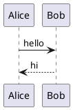
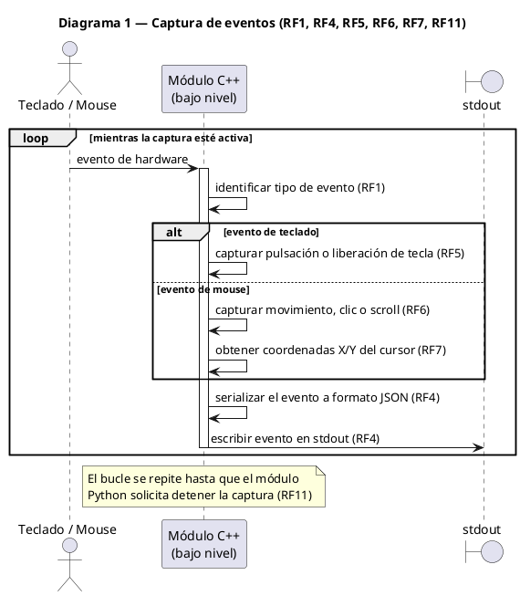
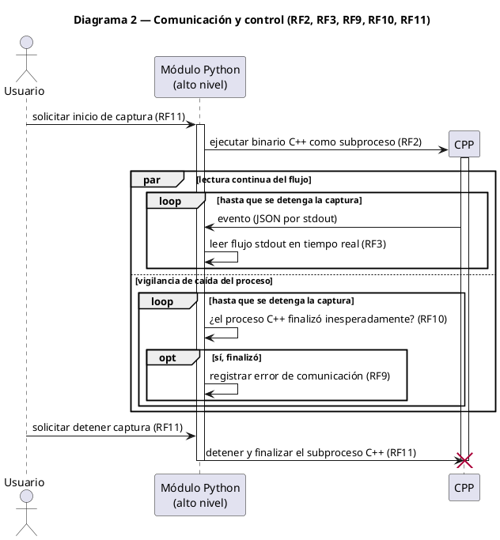
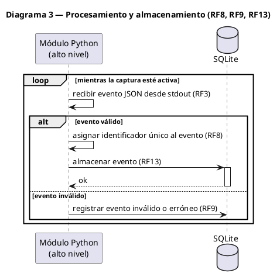
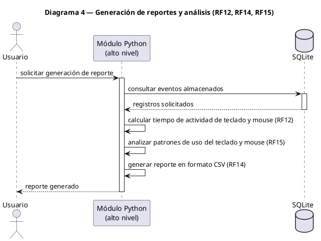

# Diagramas de Actividades — Caso 4

---

## Diagrama 1 — Captura de eventos (RF1, RF4, RF5, RF6, RF7, RF11)

---

## Diagrama 2 — Comunicación y control (RF2, RF3, RF9, RF10, RF11)

---

## Diagrama 3 — Procesamiento y almacenamiento (RF8, RF9, RF13)

---

## Diagrama 4 — Generación de reportes y análisis (RF12, RF14, RF15)

